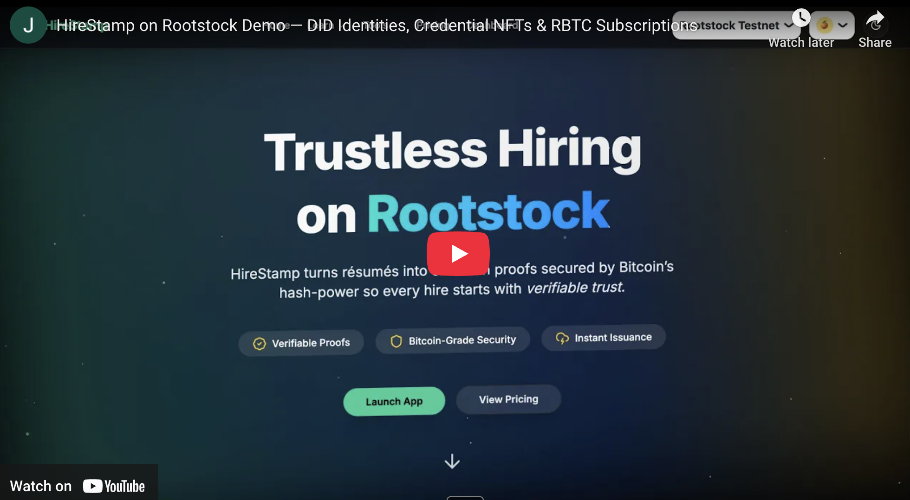

# Rivalidate — Trusted Credentials × AI-Powered Hiring

Rivalidate is a **Next.js 15 + TypeScript** platform for verifiable credentials and AI-powered recruiting. Candidates and issuers interact through smart wallets while recruiters manage talent pipelines with built‑in AI assistance.

[](https://www.youtube.com/watch?v=M5uMfI2lVjM)

---

## 🖥 User-Journey Snapshot

**Candidate**
- Wallet-first onboarding, mandatory DID mint.
- Upload credentials → UNVERIFIED · PENDING · VERIFIED/REJECTED lifecycle.
- AI-graded skill-checks; passing score triggers on-chain anchor.
- Ask the built-in AI agent to create a DID or request test funds when low on gas.

**Issuer**
- Self-service onboarding; admin approval required.
- Approve or reject verification requests — approval signs and mints the Credential NFT.

**Recruiter**
- Full-text talent search with verified-only toggle.
- Kanban pipelines, AI fit-summaries cached per recruiter × candidate.

**Admin**
- Issuer approvals, role upgrades, credential revocation.
- Platform DID rotation and plan price updates (ETH wei on Base).

---

## 🚀 Quick Start

### Prerequisites

- Node 20+, PNPM 8+
- PostgreSQL 15+

### Setup

```bash
pnpm install
cp .env.example .env                # supply database and API keys
pnpm db:setup && pnpm db:seed       # init & seed database
pnpm dev                            # runs Next.js 15 (Turbopack) on http://localhost:3000
```

### Build & Deploy

```bash
pnpm build
pnpm start
```

---

## 🔑 Environment Variables

| Name                                   | Purpose |
| -------------------------------------- | --------------------------------------------- |
| `POSTGRES_URL`                         | Postgres connection string |
| `AUTH_SECRET`                          | JWT signing secret |
| `OPENAI_API_KEY`                       | API key for GPT‑4o |
| `NEXT_PUBLIC_ONCHAINKIT_API_KEY`       | Public key for OnchainKit widgets |
| `NEXT_PUBLIC_COMMERCE_PRODUCT_FREE`    | Coinbase Commerce product id for free plan |
| `NEXT_PUBLIC_COMMERCE_PRODUCT_BASE`    | Coinbase Commerce product id for base plan |
| `NEXT_PUBLIC_COMMERCE_PRODUCT_PLUS`    | Coinbase Commerce product id for plus plan |
| `COMMERCE_API_KEY`                     | Coinbase Commerce API key |
| `ADMIN_ADDRESS`                        | Address with `ADMIN_ROLE` on contracts |
| `PLATFORM_SIGNER_PRIVATE_KEY`          | Backend signer for platform‑initiated mints |
| `BASE_MAINNET_RPC_URL`                 | RPC endpoint for Base mainnet |
| `BASE_SEPOLIA_RPC_URL`                 | RPC endpoint for Base Sepolia |
| `NEXT_PUBLIC_BASE_RPC_URL`             | Public RPC endpoint used by clients |
| `NEXT_PUBLIC_CHAIN_ID`                 | Chain id of the connected network |
| `NEXT_PUBLIC_DID_REGISTRY_ADDRESS`     | DIDRegistry contract address |
| `NEXT_PUBLIC_CREDENTIAL_NFT_ADDRESS`   | CredentialNFT contract address |
| `NEXT_PUBLIC_SUBSCRIPTION_MANAGER_ADDRESS` | SubscriptionManager contract address |
| `NEXT_PUBLIC_PLATFORM_ISSUER_DID`      | Platform DID used by the site |
| `CDP_API_KEY_NAME`                     | AgentKit API key name |
| `CDP_API_KEY_PRIVATE_KEY`              | AgentKit API key private key |
| `NETWORK_ID`                           | AgentKit network id |
| `UNISWAP_ROUTER_ADDRESS`               | Uniswap V2 router on Base Sepolia |
| `UNISWAP_FACTORY_ADDRESS`              | Uniswap V2 factory on Base Sepolia |
| `WETH_ADDRESS`                         | Wrapped ETH address |
| `USDC_ADDRESS`                         | USDC token address |

---

## 🛠 Technologies Used

- **Next.js 15 App Router** with Partial Prerendering
- **Tailwind 4** + shadcn/ui + Framer Motion
- **Drizzle ORM** for typed PostgreSQL access
- **AgentKit** for on-chain AI actions
- **OnchainKit** components for Coinbase Commerce payments
- **Vercel Edge** API routes

---

## Tracks Applied

### AI
Our platform integrates an AgentKit-powered assistant backed by GPT‑4o. It can fetch wallet details, query on-chain data, request faucet funds, mint decentralized IDs, and execute custom actions such as swapping ETH for USDC via [lib/agentkit/uniswap-v2-action-provider.ts](lib/agentkit/uniswap-v2-action-provider.ts).

### Stablecoins
Subscriptions are paid in USDC through Coinbase Commerce. Each payment is mirrored on-chain and we store the transaction hash to keep history immutable.

### DeFi
The Uniswap action provider lets the AI agent perform ETH ➜ USDC swaps on Base Sepolia. This demonstrates seamless DeFi interactions inside the hiring workflow.

### Consumer / Showcase
Rivalidate is a complete recruiting platform for candidates and recruiters. Users onboard with smart wallets and mint verifiable credentials as NFTs, showcasing a polished product ready for production.

---

## The Problem It Solves

Hiring marketplaces struggle with credential fraud and slow verification processes. **Rivalidate** anchors credentials directly on **Base**, giving recruiters cryptographic proof that a candidate truly earned their certificates.  
Crucially, **issuers** — universities, bootcamps, licensing bodies, etc. — sign and publish those credentials, providing the authoritative link between a candidate and their achievements; without the issuer’s signature, a credential cannot be verified on-chain.  
Smart-wallet onboarding lowers the barrier for non-crypto users, and an integrated AI agent assists with on-chain actions such as DID creation, token swaps, and payments. The result is a trust layer for professional credentials combined with efficient, AI-powered recruiting tools.

Traditional hiring relies on screenshots, PDFs, or phone calls to validate a résumé. Each manual check slows time-to-hire and still leaves room for fraud:

| Pain Point | Impact | Rivalidate’s Fix |
|------------|--------|------------------|
| **Fake or inflated credentials** | Recruiters waste hours verifying each claim and still miss sophisticated forgeries. | Issuers publish cryptographically signed credentials to Base; recruiters get an instant green-check or red-flag. |
| **Fragmented data silos** | Résumé data lives in dozens of HR tools; verification results aren’t portable. | Credentials are anchored on-chain and referenced by DID, so any HR system can fetch the same immutable proof. |
| **High Web3 friction** | Candidates and employers unfamiliar with wallets avoid on-chain solutions. | Coinbase Smart Wallet onboarding works with email, social, or passkeys — no seed phrases required. |
| **Trust gaps in remote hiring** | Global teams struggle to judge overseas certifications. | A global, public Base chain provides a universal source of truth, independent of geography. |

By turning each claim into a verifiable credential minted (and, if revoked, transparently burned) on Base, Rivalidate removes the “trust but verify” loop and lets recruiters focus on candidate fit rather than detective work.

---

## Challenges I Ran Into

| Challenge | Why It Was Hard | Approach & Solution |
|-----------|-----------------|---------------------|
| **On-chain ↔️ Off-chain orchestration** | Smart-contract calls must stay in strict sync with Next.js server state (e.g., account creation → NFT anchor). | Introduced an action queue in Drizzle + contract event listeners that update Postgres only after tx confirmation; retries handle L2 reorgs. |
| **Wallet onboarding for mixed audiences** | Web2 users fear seed phrases; crypto-native users expect hardcore self-custody. | Integrated Coinbase Smart Wallet with “smartWalletOnly” preference, then exposed optional export for hardware-wallet users. |
| **Extending AgentKit with custom actions** | Native AgentKit only covers generic ERC-20 flows. | Wrote a uniswapv2ActionProvider and a credential-mint action that wrap our contracts; added Zod schemas so the agent can validate parameters before calling. |
| **Mirroring Coinbase Commerce payments on-chain** | Fiat checkout happens off-chain, but recruiters want on-chain proofs for audits. | Created a webhook that mints a zero-value “PaymentReceipt” NFT when a charge is marked CONFIRMED; the token links to the Commerce charge ID so auditors can cross-check. |
| **Ensuring issuer accountability** | If an issuer’s private key is compromised, fake credentials could be minted. | Added a revocation registry and an optional multisig flow for high-value issuers; the AI agent can trigger “freeze” actions if anomaly detection flags unusual minting. |

Together these solutions allowed Rivalidate to deliver a seamless, fraud-resistant credential layer while remaining usable by HR teams that have never touched a blockchain.

---

## 🤝 Contributing

1. Fork & clone
2. Create a branch `git checkout -b feat/my-improvement`
3. Commit with [Conventional Commits](https://www.conventionalcommits.org)
4. Open a PR — GitHub Actions will lint and type-check

---

## Final Output

| Item              | Location |
| ----------------- | -------------------------------------------------------------------------------------------------------------------------------- |
| Live Demo         | https://rivalidate-base.vercel.app |
| Demo Video        | https://rivalidate-base.vercel.app/demo-video |
| Demo Video (Mirror) | https://www.youtube.com/watch?v=M5uMfI2lVjM |
