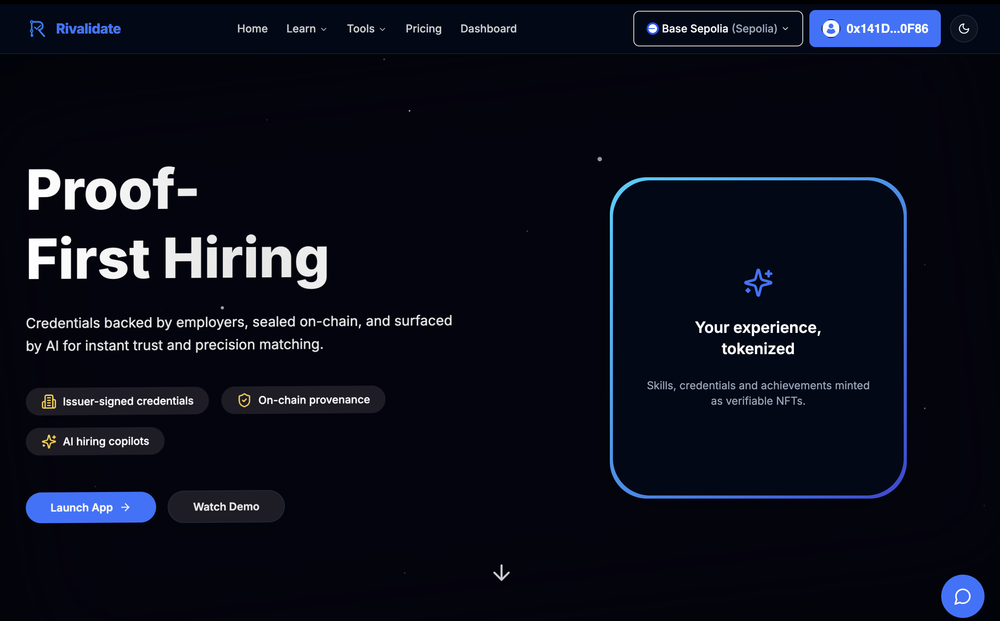

# **Rivalidate — Verifiable Talent Credentials on Base L2**

_On-chain credentials, deterministic **did:rlz** identities and subscription billing — powered by the **Rivalz World Abstraction Layer**._

---

## ✨ Why Rivalidate?

- **did:rlz identities** – every Team and Issuer mints a deterministic `did:rlz:0x…` through the on-chain **DID Registry**; that DID becomes the subject for all future credentials and profile claims.
- **Credential NFTs** – hashed W3C Verifiable Credentials are permanently anchored as ERC-721 tokens on **Base** via `CredentialNFT.mintCredential()`, giving recruiters and candidates an immutable audit trail.
- **ETH-native subscription billing** – `SubscriptionManager` settles plan fees directly in ETH; the UI shows live USD quotes and blocks checkout if the quote is older than one hour.
- **OCY-powered résumé vectorisation** – CVs are ingested through OCY DePIN, chunked and embedded so recruiters get *semantic* search across millions of profiles in milliseconds.
- **All-in-one monorepo** – Next.js 14 (App Router) frontend, Drizzle-backed PostgreSQL, fully-scripted Hardhat workspace and server actions live side-by-side for friction-less DX.

---

## 📚 Rivalz-Backed Features in Production Today

| Rivalz Feature | Rivalidate Implementation | Benefit |
| -------------- | ------------------------- | ------- |
| **OCY DePIN – Data Layer** | Résumé upload ➜ OCY vector store ➜ RAG semantic search in recruiter dashboard | Instant similarity search and AI profile summaries |
| **did:rlz Deterministic IDs** | `DIDRegistry.createDID()` mints one DID per wallet / issuer | Portable, privacy-preserving identity that travels between Web2 & Web3 |

> **Heads-up 🚧** – Modules such as **ADCS** (AI oracles), **ROME** (Swarm protocol) and **VORD** (AI app layer) are on the roadmap but **not** wired to the live platform yet, so they are intentionally omitted here.

---

## 🔄 How Rivalz Integrates End-to-End

1. **User on-boards** and signs a single message → `DIDRegistry` deterministically derives and mints `did:rlz:0x…` (gas-sponsored by the platform).
2. **Candidate uploads résumé** (PDF, DOCX, plain-text).
3. A background action pushes the file to **OCY DePIN**; OCY chunks, embeds and stores the vectors.
4. Recruiters run a **semantic query** → Rivalidate hits OCY’s RAG endpoint → receives the top-k matches (document IDs + cosine score).
5. Credential verification, plan payments and audit trails live on-chain on **Base** and are browsable on Basescan.

This blending of Ethereum-secured L2 settlement with Rivalz’s data layer yields instant full-text *and* semantic search while keeping the critical trust anchors (DID, credential hashes, payments) immutable.

---

## 🚀 Quick Start

1. **Clone & install**

~~~bash
git clone https://github.com/syntaxsurge/rivalidate.git
cd rivalidate
pnpm install
~~~

2. **Environment files**

~~~bash
cp .env.example .env
cp blockchain/.env.example blockchain/.env
~~~

Populate at minimum:

- `POSTGRES_URL`
- `BASE_SEPOLIA_RPC_URL` (or `BASE_MAINNET_RPC_URL`)
- Contract addresses returned by the deploy step below

3. **Deploy smart contracts**

All Solidity sources live in **`/blockchain`**.

~~~bash
pnpm contracts:deploy             # defaults to Base Sepolia
pnpm contracts:copy-abis          # sync ABIs into lib/
~~~

Copy the printed addresses into `.env`.

4. **Database setup** (optional Docker helper)

~~~bash
docker compose up -d postgres
pnpm db:reset
~~~

5. **Launch Rivalidate**

~~~bash
pnpm dev
~~~

Open <http://localhost:3000> and connect a Base-enabled wallet.

---

## 🖥 User-Journey Snapshot

| Role | Key Steps |
| ---- | --------- |
| **Candidate** | Wallet sign-in → automatic `did:rlz` mint → credential upload → AI skill quizzes → on-chain verification |
| **Issuer** | Self-service profile → admin approval → sign & mint Credential NFTs for pending requests |
| **Recruiter** | Hybrid (keyword + semantic) search, Kanban pipelines, AI fit summaries cached per recruiter×candidate |
| **Admin** | Issuer approvals, plan price updates, credential revocation, platform DID rotation |

---

## 🧑‍💻 Architecture at a Glance

- **Frontend** – Next.js 14, React Server/Client Components, TypeScript.
- **Backend** – PostgreSQL via Drizzle ORM, server actions, Edge-runtime middleware.
- **Blockchain** – Hardhat workspace, verified on **Basescan** (chain IDs 8453 / 84532).
- **Rivalz** – OCY DePIN for vector storage; deterministic `did:rlz` scheme for identity.

---

## 🧠 AI Workflows

Rivalidate uses **GPT-4o** for:

| Feature | Prompt Source | Validation & Rate Limits |
| ------- | ------------- | ------------------------ |
| Strict quiz auto-grader | `lib/ai/prompts.ts ➜ strictGraderMessages()` | Zod schema, 0-100 int, three retries |
| Candidate profile summary (120 words) | `lib/ai/prompts.ts ➜ summariseProfileMessages()` | Daily quota per candidate, hash-based caching |
| Recruiter-specific fit summary (JSON) | `lib/ai/prompts.ts ➜ candidateFitMessages()` | Zod schema, recruiter×candidate cache |

Exact messages live in *`lib/ai/prompts.ts`*.

---

## 📡 Roadmap

- **ADCS integration** – verifiable AI scoring & salary oracles
- **ROME Swarm agents** – crowd-sourced credential verification at scale
- **VORD plug-ins** – third-party AI tools directly inside the recruiter dashboard

Stay tuned — and feel free to open an issue or PR!

---

## Final Output

| Item                       | Location                                                                                                                                                                        |
| -------------------------- | ------------------------------------------------------------------------------------------------------------------------------------------------------------------------------- |
| Live Demo                  | https://rivalidate-base.vercel.app                                                                                                                                                           |
| Demo Video                 | https://rivalidate-base.vercel.app/demo-video                                                                                                                                                |
| Demo Video (Mirror)        | https://youtu.be/xxxxxxx                                                                                                                                                    |
| Presentation Deck          | https://rivalidate-base.vercel.app/pitch-deck                                                                                                                                                |
| Presentation Deck (Mirror) | https://www.canva.com/design/DAGma8Zzkiw/L6sLnrb9L8qyjxhDGsnSyg/view?utm_content=DAGma8Zzkiw&utm_campaign=designshare&utm_medium=link2&utm_source=uniquelinks&utlId=h570be312c9 |

## 🙋 Need Help?

Start a discussion or open a GitHub issue. We love feedback and contributors 💙