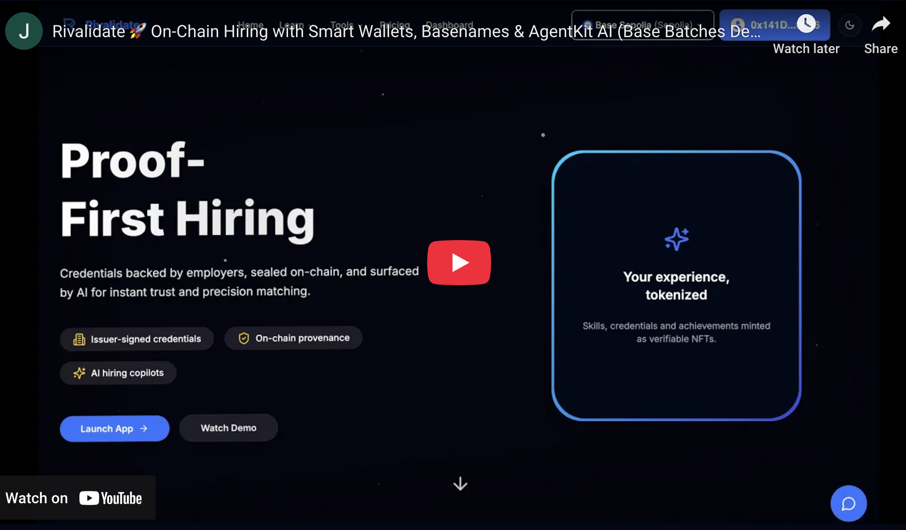

# Rivalidate — Trusted Credentials × AI-Powered Hiring

Rivalidate is a **Next.js 15 + TypeScript** platform that issues verifiable credentials, builds beautiful PDF résumés on-the-fly, and unlocks **semantic talent discovery** through Rivalz OCY vector storage.

[](https://youtu.be/3jSGbr54D1M)

---

## ✨ Core Features

| Domain     | Capability                                                                                                                                                                                                         |
| ---------- | ------------------------------------------------------------------------------------------------------------------------------------------------------------------------------------------------------------------ |
| Candidates | • Responsive dashboard for profile, credentials, highlights, résumé, skill quizzes<br>• **Auto-generated PDF résumé** with one-click download<br>• **Automatic vectorization** of every résumé change (OCY RAG KB) |
| Recruiters | • Applicant tracking with pipelines & boards<br>• Classic filter & sort AND **⌥ Enter semantic search** powered by résumé vectors<br>• Instant fit scoring & credential drill-down                                 |
| Admin      | • User / issuer / pricing management<br>• Platform DID controls                                                                                                                                                    |
| API        | • RESTful routes under `/api` with strict auth guards<br>• `POST /api/candidates/:id/resume/vectorize` idempotently (re)vectorizes a résumé                                                                        |
| DevEx      | • Monorepo-level typed SQL via Drizzle ORM<br>• E2E logging proxy for all Rivalz SDK calls<br>• Edge-safe cron endpoint for nightly re-vectorization                                                               |

---

## 🗺️ High-Level Flow

1. **Profile Edit →** `vectorizeResume(candidateId)` helper<br>
2. Helper renders PDF, **upserts** `resume_<id>` knowledge-base via OCY, and returns `kbId`.<br>
3. Candidate résumé page polls KB → shows **processing → ready** badge.<br>
4. Recruiter **⌥ Enter** searches call `queryResumeVectors(prompt)` which<br>&nbsp;&nbsp;&bull; queries every KB in parallel and returns ranked `candidateIds`.<br>
5. SQL filter merges the ranked IDs → results keep original pagination & ordering.

---

## 🖥 User-Journey Snapshot

| Role          | Key Steps                                                                                                 |
| ------------- | --------------------------------------------------------------------------------------------------------- |
| **Candidate** | Wallet sign-in → automatic `did:base` mint → credential upload → AI skill quizzes → on-chain verification |
| **Issuer**    | Self-service profile → admin approval → sign & mint Credential NFTs for pending requests                  |
| **Recruiter** | Hybrid (keyword + semantic) search, Kanban pipelines, AI fit summaries cached per recruiter×candidate     |
| **Admin**     | Issuer approvals, plan price updates, credential revocation, platform DID rotation                        |

---

## 🚀 Quick Start

### Prerequisites

- Node 20+, PNPM 8+
- PostgreSQL 15+
- **Rivalz API key** (`RIVALZ_API_KEY`) with at least 1 KB credit

### Setup

```bash
pnpm install
cp .env.example .env                # add DB_URL + RIVALZ_API_KEY …
pnpm db:setup && pnpm db:seed       # init & seed database
pnpm dev                            # runs Next.js 15 (Turbopack) on http://localhost:3000
```

### Build & Deploy

```bash
pnpm build
pnpm start
```

_Vercel tip:_ add `RIVALZ_API_KEY`, `DATABASE_URL`, and `NEXT_PRIVATE_*` secrets under **Project → Environment Variables**.

---

## 🔑 Environment Variables

| Name                  | Purpose                             |
| --------------------- | ----------------------------------- |
| `RIVALZ_API_KEY`      | Secret for OCY vector and chat APIs |
| `DATABASE_URL`        | Postgres connection string          |
| `NEXT_PUBLIC_APP_URL` | Absolute URL for emails / redirects |

---

## 📝 Résumé Vectorization Internals

- **Helper:** `lib/ocy/vectorize-resume.ts`
  • Generates PDF via `buildResumeData → generateResumePdf`
  • Writes to `fs.mkdtemp()` directory to avoid collisions
  • Checks `getKnowledgeBases()` for `resume_<id>` KB
  • Calls `addDocumentToKnowledgeBase` or `createRagKnowledgeBase` accordingly
  • Returns `kbId` so UI can poll status

- **Trigger Points**
  • Candidate profile save
  • Credential add / update / delete
  • Highlight create / delete

These mutations return `{ vectorizing: true }` for optimistic feedback.

---

## 🔍 Semantic Talent Search

- Press **⌥ Enter** (desktop) or long-press Enter (mobile) in the recruiter talent search bar.
- The query text is vector-matched against all résumé KBs via `queryResumeVectors()`.
- The resulting candidate ID list is merged into the SQL `WHERE … IN (…)` clause allowing regular filters (location, tags, etc.) to stack.

---

## ⏰ Nightly Vector Refresh

Add a Vercel Cron or GitHub Actions job:

```bash
curl -X POST "$APP_URL/api/cron/resume-vectorize"
```

The route iterates active candidates and hits the idempotent vectorize endpoint to refresh embeddings.

---

## 🛠 Scripts

| Script                                                     | Description                                                                       |
| ---------------------------------------------------------- | --------------------------------------------------------------------------------- |
| `pnpm ts-node scripts/hackathon/demo-search.ts "<prompt>"` | Prints top-10 candidates with OCY similarity scores — showcase for hack4PH judges |
| `pnpm db:*`                                                | Setup, migrate, reset helpers                                                     |
| `pnpm contracts:*`                                         | Hardhat deployment & ABI sync                                                     |

---

## 📚 Tech Stack

- **Next.js 15 App Router** with Partial Prerendering
- **Tailwind 4** + shadcn/ui + Framer Motion
- **Drizzle ORM** (typed Postgres)
- **Wagmi** & **RainbowKit** wallet onboarding
- **Rivalz OCY** SDK for vector storage & RAG chat
- **Vercel Edge** for cron & API routes

---

## 🧠 AI Workflows

Rivalidate uses **GPT-4o** for:

| Feature                               | Prompt Source                                    | Validation & Rate Limits                      |
| ------------------------------------- | ------------------------------------------------ | --------------------------------------------- |
| Strict quiz auto-grader               | `lib/ai/prompts.ts ➜ strictGraderMessages()`     | Zod schema, 0-100 int, three retries          |
| Candidate profile summary (120 words) | `lib/ai/prompts.ts ➜ summariseProfileMessages()` | Daily quota per candidate, hash-based caching |
| Recruiter-specific fit summary (JSON) | `lib/ai/prompts.ts ➜ candidateFitMessages()`     | Zod schema, recruiter×candidate cache         |

Exact messages live in _`lib/ai/prompts.ts`_.

---

## 📡 Roadmap

- **ADCS integration** – verifiable AI scoring & salary oracles
- **ROME Swarm agents** – crowd-sourced credential verification at scale
- **VORD plug-ins** – third-party AI tools directly inside the recruiter dashboard

Stay tuned — and feel free to open an issue or PR!

---

## Final Output

| Item                       | Location                                                                                                                                                                        |
| -------------------------- | ------------------------------------------------------------------------------------------------------------------------------------------------------------------------------- |
| Live Demo                  | https://rivalidate-base.vercel.app                                                                                                                                              |
| Demo Video                 | https://rivalidate-base.vercel.app/demo-video                                                                                                                                   |
| Demo Video (Mirror)        | https://youtu.be/3jSGbr54D1M                                                                                                                                                    |
| Presentation Deck          | https://rivalidate-base.vercel.app/pitch-deck                                                                                                                                   |
| Presentation Deck (Mirror) | https://www.canva.com/design/DAGma8Zzkiw/L6sLnrb9L8qyjxhDGsnSyg/view?utm_content=DAGma8Zzkiw&utm_campaign=designshare&utm_medium=link2&utm_source=uniquelinks&utlId=h570be312c9 |

---

## 🤝 Contributing

1. Fork & clone
2. Create a branch `git checkout -b feat/my-improvement`
3. Commit with [Conventional Commits](https://www.conventionalcommits.org)
4. Open a PR — GitHub Actions will lint, test, and type-check
